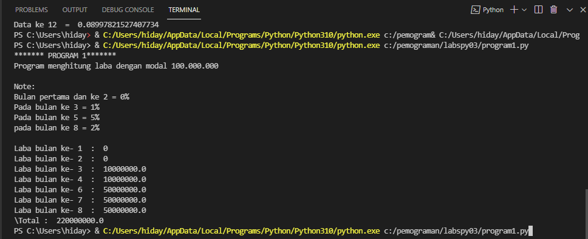

# labspy03 tugas pemograman

latihan 1

pada latihan 1 ini saya di beri soal seperti berikut

untuk mengerjakan nya,saya menggunakan syntak di bawah ini : 

    import random
    print(40*"=")
    print("Bilangan acak yang lebih kecil dari 0,5")
    print(40*"=")
    jum = int( input("Masukan nilai n : "))
    i = 0
    for i in range(jum):
        i += 1
        angkaDec = random.uniform(0, 0.5)
        print("Data ke", i, " = ", angkaDec)

dan saya mendapatkan output

latihan 2

pada latihan 2 saya di beri tugas seperti ini : 

latihan 2

untuk mengerjakan nya saya menggunakan syntax di bawah ini :

    print("menampilkan bilangan berhenti ketika bilangan 0 dan menampilkan bilangan terbesar")

    max=0
    while True:
        a=int(input("masukan bilangan : "))
        if max < a :
            max = a
        if a==0:
            break
    print("bilangan terbesar adalah = ",max)

dan saya mendapatkan output seperti di bawah ini : 

program 1

pada program1 saya di beri tugas seperti ini : 

    print("******* PROGRAM 1*******")
    print("Program menghitung laba dengan modal 100.000.000")
    print("")
    print("Note:")
    print("Bulan pertama dan ke 2 = 0%")
    print("Pada bulan ke 3 = 1%")
    print("Pada bulan ke 5 = 5%")
    print("pada bulan ke 8 = 2%")
    print("")
    #variable
    a = 100000000
    for x in range(1,9):
        if(x>=1 and x<=2):
            b = a*0
            print("Laba bulan ke-",x," : ",b)
        if(x>=3 and x<=4):
            c = a*0.1
            print("Laba bulan ke-",x," : ",c)
        if(x>5 and x<=7):
            d = a*0.5
            print("Laba bulan ke-",x," : ",d)
        if(x==8):
            e = a*0.5
            print("Laba bulan ke-",x," : ",e)
    total=b+b+c+c+d+d+d+e
    print("\Total : ",total)

dan saya mendapat output seperti di bawah ini :

Terima kasih

